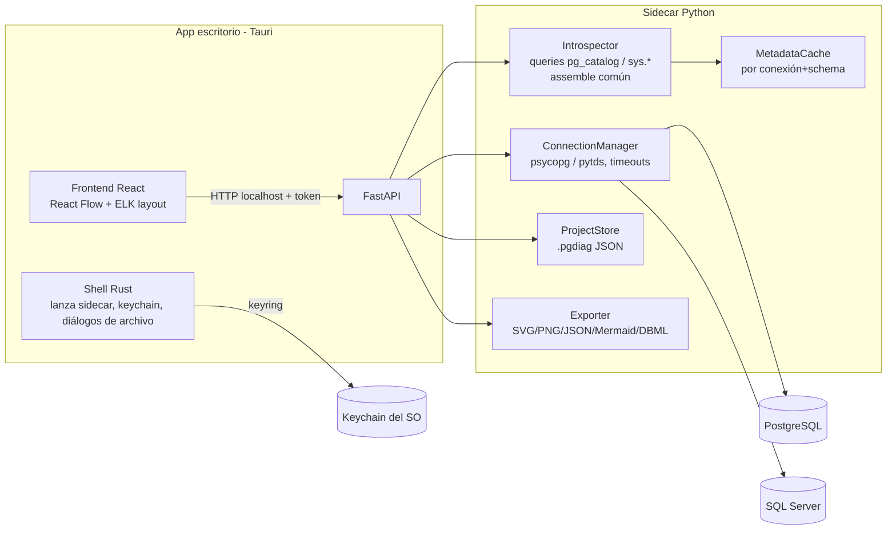
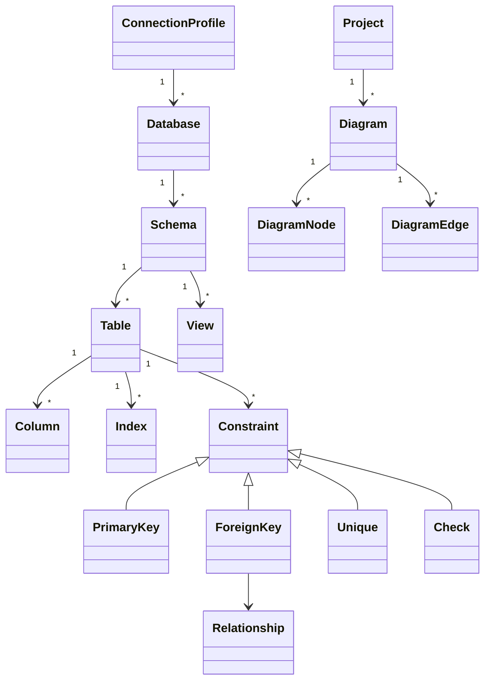

# pg-diagrammer — Diseño, plan y especificación

Utilidad de escritorio para conectarse a PostgreSQL y SQL Server, explorar sus objetos y construir diagramas ER editables arrastrando tablas a un lienzo, con relaciones y cardinalidad detectadas automáticamente.

**Stack decidido:** Tauri (shell nativo Win/macOS/Linux) + sidecar Python (FastAPI) para toda la lógica de metadatos + frontend React con React Flow para el lienzo. Drivers: psycopg 3 (PostgreSQL) y python-tds (SQL Server).

---

## 1. Arquitectura propuesta

### 1.1 Decisiones técnicas clave

| Decisión | Elección | Alternativa descartada | Razón |
|---|---|---|---|
| Shell de app | Tauri 2 | Electron | Binario ~10x más ligero, webview del SO, acceso a keychain nativo |
| Lógica de metadatos | Sidecar Python (FastAPI + psycopg 3), empaquetado con PyInstaller y lanzado por Tauri como proceso hijo | Reescribir en Rust | Preferencia del usuario por Python; psycopg es maduro; Tauri soporta sidecars de forma nativa |
| Comunicación shell↔lógica | HTTP en `127.0.0.1` puerto efímero + token de sesión generado al arranque | IPC de Tauri | Contrato REST testeable de forma independiente; el mismo backend serviría una futura web app |
| Lienzo de diagramas | React Flow + auto-layout con ELK/dagre | D3 a medida, GoJS | Drag & drop, nodos custom (tablas), minimapa y zoom listos; GoJS es de pago |
| Lectura de metadatos | `pg_catalog` con consultas en bloque (todo el schema en 5–6 queries) | `information_schema`, query por tabla | Orden de magnitud más rápido; evita N+1 y cumple la meta de 500 tablas < 15 s |
| Persistencia de proyectos | Archivo `.pgdiag` (JSON versionado) por proyecto | SQLite | Formato editable/versionable en git; cumple el entregable de export editable |
| Credenciales | Keychain del SO vía `keyring` (Python); el `.pgdiag` guarda solo una referencia | Archivo cifrado propio | Requisito de no guardar texto plano sin inventar criptografía propia |
| Driver SQL Server | `python-tds` (TDS puro Python) | pyodbc, pymssql | Sin dependencia del ODBC Driver de Microsoft en la máquina del usuario; empaqueta limpio con PyInstaller en las 3 plataformas; soporta SQL auth, NTLM y SSPI (Windows integrada) |

**Trade-off explícito del sidecar:** dos runtimes (Rust mínimo + Python) complican el empaquetado (PyInstaller por plataforma en CI), a cambio de mantener toda la lógica en Python y un contrato HTTP reutilizable. Se revisitaría si el binario resultara problemático: la interfaz REST permite portar el backend a Rust sin tocar el frontend.

**Diseño multi-motor.** El perfil de conexión lleva `engine` (`postgresql` | `sqlserver`, default postgresql para retrocompatibilidad) y `auth_method` (`sql` | `windows`). Cada motor tiene su capa de conexión (`connections/manager.py` + `connections/mssql.py`) y sus queries en bloque (`introspection/queries.py` sobre `pg_catalog`, `introspection/mssql_queries.py` sobre `sys.*`), pero ambos adaptan sus filas a la MISMA función pura `assemble()` de `introspector.py` (correspondencias: `object_id`↔`oid`, `column_id`↔`attnum`, `'U'/'V'`↔`relkind`). Así la derivación de cardinalidad, el diff de snapshots y el cache son un único código. Los errores de ambos drivers se clasifican al mismo envelope (`classify_db_error`). El constructor de consultas genera SQL por dialecto: comillas dobles en PostgreSQL; en T-SQL identificadores sin citar, con `[corchetes]` solo cuando el nombre lo exige.

### 1.2 Componentes y flujo de datos

Flujo típico: la UI pide conexión → shell recupera credenciales del keychain → sidecar abre pool y prueba `SELECT 1` con timeout → UI lista bases de datos → usuario elige BD → Introspector carga schemas/tablas en bloque y cachea → UI muestra árbol navegable con búsqueda → usuario arrastra tablas al lienzo → el frontend resuelve FKs entre nodos presentes y dibuja aristas con cardinalidad → guardar escribe `.pgdiag`.

El render de export SVG/PNG se hace en el frontend (serialización del canvas), no en Python: garantiza WYSIWYG sin pérdida de etiquetas.

### 1.3 Seguridad

- Sidecar escucha solo en `127.0.0.1`, puerto efímero; toda petición exige el header `X-Session-Token` generado por el shell al arranque.
- Credenciales solo en keychain (Credential Manager / Keychain / Secret Service). El `.pgdiag` referencia `connection_id`, nunca la contraseña.
- SSL/TLS opcional por conexión (`sslmode` require/verify-full, CA custom en PostgreSQL).
- Rol de BD recomendado: solo lectura; la app jamás ejecuta DDL/DML, solo `SELECT` sobre catálogos. En PostgreSQL las consultas del usuario corren en transacción READ ONLY; en SQL Server (sin transacciones de solo lectura) se valida que la sentencia empiece por `SELECT`/`WITH`.
- SQL Server con `auth_method: windows`: SSPI (usuario de la sesión, sin contraseña, solo Windows) o NTLM (`DOMINIO\usuario` + contraseña, cualquier SO).
- **Decodificación tolerante de columnas de texto (no quitar).** `connections/mssql.py` envuelve `Collation.get_codec` de python-tds para que la decodificación con la codepage del collation nunca lance `UnicodeDecodeError`. Es habitual encontrar bytes no definidos en la codepage (p. ej. 0x81 en cp1252, texto UTF-8 guardado en columnas `varchar`); sin esto, UNA fila corrupta rompe la consulta entera. Siendo un visor de solo lectura, se prefiere mostrar la fila con el carácter sustituido a perder el resultado completo (para datos válidos el texto es idéntico). Hay que cubrir los **dos** caminos de lectura del driver: `read_str` para `char`/`varchar(n)` y el **decodificador incremental** (`iterdecode`) para `varchar(max)`/`text` — parchear solo el primero deja el fallo vivo en las columnas grandes.

---

## 2. Modelo de dominio (metadatos, común a ambos motores)

Entidades núcleo (Pydantic en el sidecar, TypeScript espejo en la UI):

- **ConnectionProfile**: `id, name, engine (postgresql|sqlserver), host, port, user, auth_method (sql|windows), ssl_mode, credential_ref` (referencia a keychain).
- **Table**: `schema, name, oid, kind (table|view|matview|partitioned|foreign), comment, estimated_rows`.
- **Column**: `name, position, data_type, is_nullable, default, is_pk, comment`.
- **ForeignKey**: `name, columns[], ref_schema, ref_table, ref_columns[], on_delete, on_update`.
- **Relationship** (derivada): `source, target, cardinality` — calculada así: FK cuyas columnas coinciden con un UNIQUE/PK propio → `1:1`; FK normal → `N:1`; FK compuesta parcial de PK (tabla puente) → participa en `N:M` detectado.
- **Project / Diagram**: `Diagram = {nodes: [{table_ref, x, y, color, collapsed, visible_columns}], edges: [{fk_ref, waypoints?, label?}], groups: [{schema|custom, members}]}`. Todo serializable a `.pgdiag` (JSON con `format_version`).

---

## 3. API del sidecar (módulos clave)

Base: `http://127.0.0.1:{port}/api/v1`, todas con `X-Session-Token`.

| Método y ruta | Función |
|---|---|
| `POST /connections/test` | Prueba conexión (timeout 8 s), devuelve versión del servidor o error clasificado |
| `POST /connections` / `GET /connections` | Alta (guarda credencial en keychain) y listado de perfiles |
| `GET /connections/{id}/databases` | PostgreSQL: `pg_database` (no template); SQL Server: `sys.databases` accesibles y en línea (sin las de sistema) |
| `GET /db/{id}/{dbname}/schemas` | Schemas con conteo de objetos |
| `GET /db/.../objects?schema=&type=&q=&limit=&offset=` | Listado paginado con búsqueda — carga incremental para bases grandes |
| `GET /db/.../tables/{schema}.{table}` | Detalle: columnas, PK, FKs, índices, constraints |
| `POST /db/.../introspect` | Carga en bloque de schemas seleccionados → snapshot cacheado con `snapshot_id` |
| `GET /db/.../relationships?tables=[...]` | FKs entre un conjunto de tablas (para pintar aristas al soltar en el lienzo) |
| `POST /db/.../refresh` | Invalida cache y re-introspecta (diff opcional contra snapshot previo) |
| `POST /db/.../query` | Ejecuta una consulta de SOLO LECTURA (PostgreSQL: transacción READ ONLY; SQL Server: validación SELECT/WITH) con límite de filas |
| `POST /db/.../query/explain` | Plan de ejecución de la consulta: `mode=estimated` (no la ejecuta — `EXPLAIN` / `SET SHOWPLAN_ALL ON`) o `mode=actual` (`EXPLAIN ANALYZE` / `SET STATISTICS PROFILE ON`). Ambos motores devuelven el MISMO árbol normalizado (`domain/explain.py`) |
| `GET/POST/PUT /projects`, `/projects/{id}/diagrams` | CRUD de proyectos y diagramas (`.pgdiag`) |
| `POST /export` | `{diagram_id, format: svg\|png\|json\|mermaid\|dbml}` → archivo |

Errores: envelope uniforme `{code, message, hint, retriable}` con códigos accionables (`AUTH_FAILED`, `NETWORK_UNREACHABLE`, `PERMISSION_DENIED` con el objeto afectado, `TIMEOUT`, `SSL_ERROR`). La UI los traduce a mensajes con acción sugerida — requisito de robustez.

Módulos Python: `connections/` (manager multi-motor + mssql, keyring), `introspection/` (queries pg_catalog + mssql_queries sys.* + introspectores + cache + diff), `domain/` (modelos Pydantic), `projects/` (serialización .pgdiag y migración de versiones), `export/` (Mermaid/DBML/JSON; SVG/PNG llegan del frontend), `api/` (routers FastAPI).

---

## 4. Plan de implementación por fases

**Fase 0 — Esqueleto (1 semana).** Repo mono con `/sidecar` (Python) y `/app` (Tauri+React); CI que empaqueta sidecar con PyInstaller en las 3 plataformas; handshake shell↔sidecar con token; docker-compose con PostgreSQL de pruebas sembrado.

**Fase 1 — MVP conexión + exploración (2–3 semanas).** Perfiles de conexión con keychain y SSL; listado de BDs; introspección en bloque de tablas/columnas/PK/FK; árbol navegable con búsqueda y filtro por schema/tipo; manejo de errores clasificado. *Sale: usuario conecta y explora.*

**Fase 2 — MVP diagramas (2–3 semanas).** Lienzo React Flow: arrastrar tablas desde el árbol; nodos-tabla con columnas y marcadores PK/FK; aristas automáticas con cardinalidad (notación crow's foot) al soltar tablas relacionadas; auto-layout ELK; guardar/abrir `.pgdiag`; export PNG y SVG. *Sale: criterio de aceptación principal completo — este es el flujo descrito en el brief original (arrastrar tabla por tabla y ver relaciones con cardinalidad).*

**Fase 3 — Personalización (2 semanas).** Ocultar/mostrar columnas por nodo, colapsar nodos, colores, agrupar por schema, incluir/excluir objetos, múltiples diagramas por proyecto, vistas guardadas, export Mermaid/DBML/JSON.

**Fase 4 — Escala y pulido (2 semanas).** Paginación/virtualización para bases de 500+ tablas; refresh con diff (resaltar tablas nuevas/cambiadas); vistas y vistas materializadas en diagramas; índices y checks en el panel de detalle; onboarding para cumplir la meta de "primer diagrama en < 3 minutos".

Backlog posterior: detección heurística de relaciones sin FK, modo comparación entre snapshots, export a draw.io, temas.

---

## 5. Estrategia de pruebas y criterios de aceptación

**Unitarias (pytest).** Parsers de catálogo → modelos de dominio; derivación de cardinalidad (casos: FK simple, FK a UNIQUE, FK compuesta, tabla puente, self-reference); adaptadores SQL Server (filas `sys.*` simuladas → `assemble()`, formateo de tipos, acciones de FK); clasificación de errores de ambos drivers; serialización/migración `.pgdiag`; generación Mermaid/DBML.

**Integración.** `testcontainers-python` con PostgreSQL 13–17; BD semilla con ~60 tablas cubriendo particiones, schemas múltiples, FKs compuestas, vistas, tipos exóticos (arrays, enums, jsonb, dominios). Verifica el contrato completo de la API y la meta de **≥ 95 % de FKs detectadas** (assertion contra el DDL semilla — objetivo real: 100 % de FKs declaradas).

**Rendimiento (CI, umbrales de las metas).** BD sintética de 500 tablas / 2.000 FKs: introspección en bloque < 15 s; conexión+listado < 10 s; `GET /relationships` para 50 tablas < 1 s (soporta diagrama inicial < 5 s).

**E2E (Playwright + skill playwright-cli sobre build Tauri).** Flujo de aceptación: conectar → elegir BD → buscar tabla → arrastrar 5 tablas → verificar aristas y cardinalidades → guardar proyecto → reabrir → exportar PNG/SVG y comprobar que el SVG contiene todos los nombres y aristas (export sin pérdida).

**Criterios de aceptación (trazables al brief).**

1. Conectar, elegir BD, explorar y generar diagrama sin pasos manuales externos → cubierto por E2E de Fase 2.
2. Personalizar objetos visibles y guardar la configuración → Fase 3 + test de round-trip `.pgdiag`.
3. Export PNG y SVG → Fase 2 + test de fidelidad de export.
4. Errores claros y accionables → catálogo de códigos con `hint`; test de integración por cada clase de fallo (credencial mala, host inalcanzable, sin permisos sobre schema, timeout).

---

## 6. Riesgos técnicos y mitigaciones

| Riesgo | Impacto | Mitigación |
|---|---|---|
| Empaquetado del sidecar Python (PyInstaller) falla por plataforma o dispara antivirus en Windows | Alto — bloquea distribución | CI matricial desde Fase 0; firma de código en Windows/macOS; plan B documentado: portar backend a Rust detrás del mismo contrato REST |
| Bases muy grandes (miles de tablas) degradan UI y layout | Medio | Introspección por schema bajo demanda, paginación en API, virtualización del árbol, límite blando de nodos por diagrama con aviso |
| Cardinalidad incorrecta en casos raros (FK compuestas parciales, herencia, particiones) | Medio — mina confianza | Suite de casos límite en la BD semilla; cuando sea ambigua, mostrar "N:1 (inferida)" y permitir corrección manual persistida en el diagrama |
| Usuario sin permisos sobre `pg_catalog` de ciertos objetos | Medio | Introspección tolerante: lo inaccesible se lista como "sin permiso" con hint del GRANT necesario, sin abortar la carga |
| Diferencias entre versiones de PostgreSQL (13–17) en catálogos | Bajo–medio | Queries sobre columnas estables de `pg_catalog`; matriz de versiones en testcontainers |
| Variantes de SQL Server (versiones, instancias con nombre, Azure SQL) | Bajo–medio | Queries sobre vistas `sys.*` estables desde SQL Server 2012; agregación de filas en Python (sin `STRING_AGG`, compatible con versiones antiguas); puerto configurable en el perfil |
| Export PNG en canvas grandes (memoria del webview) | Bajo | Render por tiles o límite de resolución con aviso; SVG como formato primario |
| Deriva del cache de metadatos frente a la BD real | Bajo | Botón Refresh con diff visual; timestamp de snapshot visible en la UI |

---

## 7. Trazabilidad de metas medibles

| Meta | Mecanismo de diseño que la garantiza | Verificación |
|---|---|---|
| Conexión < 10 s | Pool psycopg con `connect_timeout=8` | Test de rendimiento CI |
| 500 tablas < 15 s | Queries en bloque a `pg_catalog` (sin N+1) + cache | Benchmark CI con BD sintética |
| Diagrama inicial < 5 s | Metadatos ya cacheados; layout ELK en web worker | Medición E2E |
| ≥ 95 % FKs detectadas | Lectura directa de `pg_constraint` (contype='f') | Assertion contra DDL semilla |
| Export sin pérdida | SVG serializado del propio canvas (WYSIWYG) | Test de fidelidad de export |
| Primer diagrama < 3 min | Onboarding Fase 4 + flujo de 4 pasos sin config previa | Prueba de usabilidad guiada |
